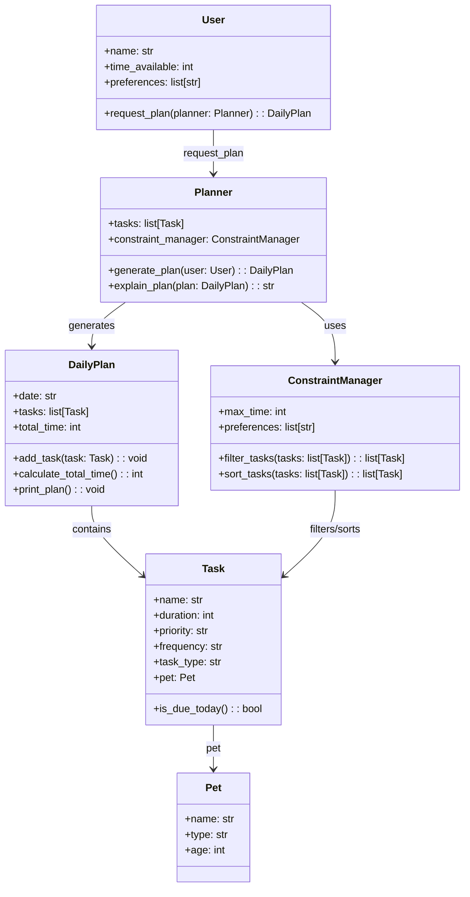

```mermaid
classDiagram
    class Pet {
        +name: str
        +type: str
        +age: int
    }

    class Task {
        +name: str
        +duration: int
        +priority: str
        +frequency: str
        +task_type: str
        +pet: Pet
        +is_due_today(): bool
    }

    class User {
        +name: str
        +time_available: int
        +preferences: list[str]
        +request_plan(planner: Planner): DailyPlan
    }

    class ConstraintManager {
        +max_time: int
        +preferences: list[str]
        +filter_tasks(tasks: list[Task]): list[Task]
        +sort_tasks(tasks: list[Task]): list[Task]
    }

    class DailyPlan {
        +date: str
        +tasks: list[Task]
        +total_time: int
        +add_task(task: Task): void
        +calculate_total_time(): int
        +print_plan(): void
    }

    class Planner {
        +tasks: list[Task]
        +constraint_manager: ConstraintManager
        +generate_plan(user: User): DailyPlan
        +explain_plan(plan: DailyPlan): str
    }

    Task --> Pet : pet
    User --> Planner : request_plan
    Planner --> DailyPlan : generates
    Planner --> ConstraintManager : uses
    DailyPlan --> Task : contains
    ConstraintManager --> Task : filters/sorts
```