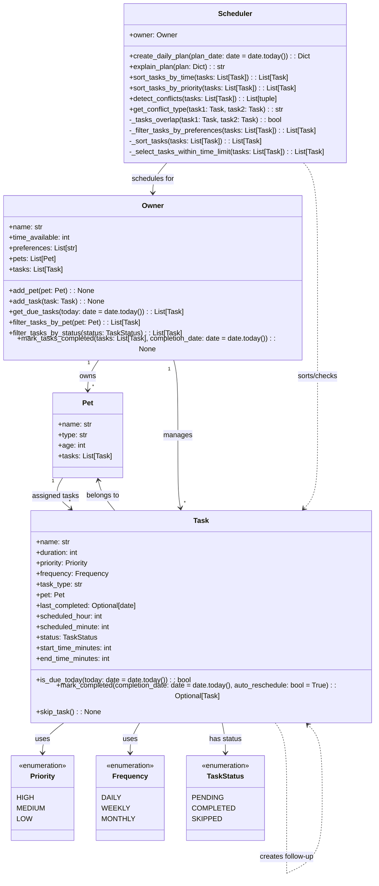

# PawPal+ UML Diagram

```mermaid
classDiagram
    class Pet {
        +name: str
        +type: str
        +age: int
        +tasks: List[Task]
    }

    class Task {
        +name: str
        +duration: int
        +priority: Priority
        +frequency: Frequency
        +task_type: str
        +pet: Pet
        +last_completed: Optional[date]
        +scheduled_hour: int
        +scheduled_minute: int
        +status: TaskStatus
        +start_time_minutes: int
        +end_time_minutes: int
        +is_due_today(today: date = date.today()): bool
        +mark_completed(completion_date: date = date.today(), auto_reschedule: bool = True): Optional[Task]
        +skip_task(): None
    }

    class Owner {
        +name: str
        +time_available: int
        +preferences: List[str]
        +pets: List[Pet]
        +tasks: List[Task]
        +add_pet(pet: Pet): None
        +add_task(task: Task): None
        +get_due_tasks(today: date = date.today()): List[Task]
        +filter_tasks_by_pet(pet: Pet): List[Task]
        +filter_tasks_by_status(status: TaskStatus): List[Task]
        +mark_tasks_completed(tasks: List[Task], completion_date: date = date.today()): None
    }

    class Scheduler {
        +owner: Owner
        +create_daily_plan(plan_date: date = date.today()): Dict
        +explain_plan(plan: Dict): str
        +sort_tasks_by_time(tasks: List[Task]): List[Task]
        +sort_tasks_by_priority(tasks: List[Task]): List[Task]
        +detect_conflicts(tasks: List[Task]): List[tuple]
        +get_conflict_type(task1: Task, task2: Task): str
        -_tasks_overlap(task1: Task, task2: Task): bool
        -_filter_tasks_by_preferences(tasks: List[Task]): List[Task]
        -_sort_tasks(tasks: List[Task]): List[Task]
        -_select_tasks_within_time_limit(tasks: List[Task]): List[Task]
    }

    class Priority {
        <<enumeration>>
        HIGH
        MEDIUM
        LOW
    }

    class Frequency {
        <<enumeration>>
        DAILY
        WEEKLY
        MONTHLY
    }

    class TaskStatus {
        <<enumeration>>
        PENDING
        COMPLETED
        SKIPPED
    }

    Owner "1" --> "*" Pet : owns
    Owner "1" --> "*" Task : manages
    Pet "1" --> "*" Task : assigned tasks
    Task --> Pet : belongs to
    Scheduler --> Owner : schedules for
    Scheduler ..> Task : sorts/checks
    Task --> Priority : uses
    Task --> Frequency : uses
    Task --> TaskStatus : has status
    Task ..> Task : creates follow-up
```
