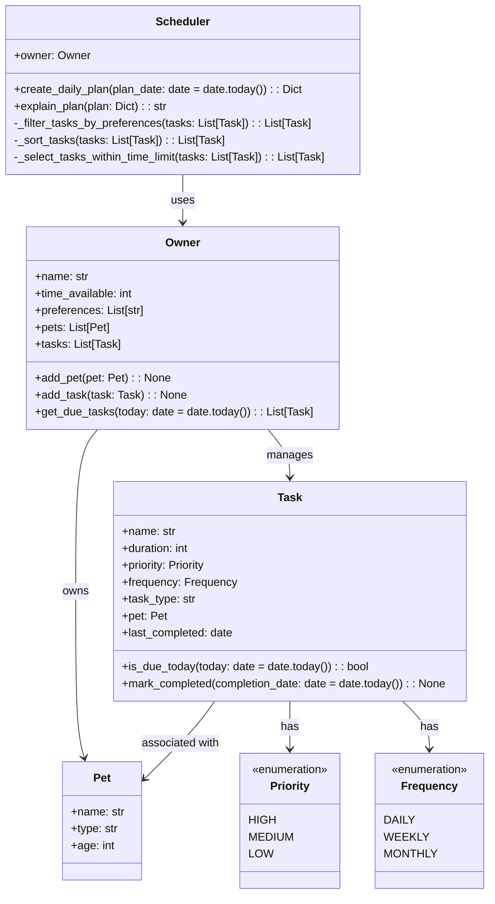

# PawPal+ UML Diagram

```mermaid
classDiagram
    class Pet {
        +name: str
        +type: str
        +age: int
    }

    class Task {
        +name: str
        +duration: int
        +priority: Priority
        +frequency: Frequency
        +task_type: str
        +pet: Pet
        +last_completed: date
        +is_due_today(today: date = date.today()): bool
        +mark_completed(completion_date: date = date.today()): None
    }

    class Owner {
        +name: str
        +time_available: int
        +preferences: List[str]
        +pets: List[Pet]
        +tasks: List[Task]
        +add_pet(pet: Pet): None
        +add_task(task: Task): None
        +get_due_tasks(today: date = date.today()): List[Task]
    }

    class Scheduler {
        +owner: Owner
        +create_daily_plan(plan_date: date = date.today()): Dict
        +explain_plan(plan: Dict): str
        -_filter_tasks_by_preferences(tasks: List[Task]): List[Task]
        -_sort_tasks(tasks: List[Task]): List[Task]
        -_select_tasks_within_time_limit(tasks: List[Task]): List[Task]
    }

    class Priority {
        <<enumeration>>
        HIGH
        MEDIUM
        LOW
    }

    class Frequency {
        <<enumeration>>
        DAILY
        WEEKLY
        MONTHLY
    }

    Task --> Pet : associated with
    Owner --> Pet : owns
    Owner --> Task : manages
    Scheduler --> Owner : uses
    Task --> Priority : has
    Task --> Frequency : has
```